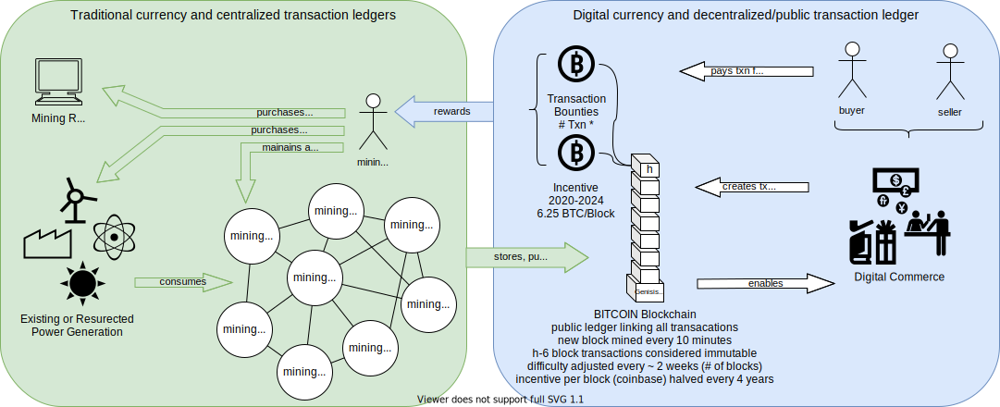
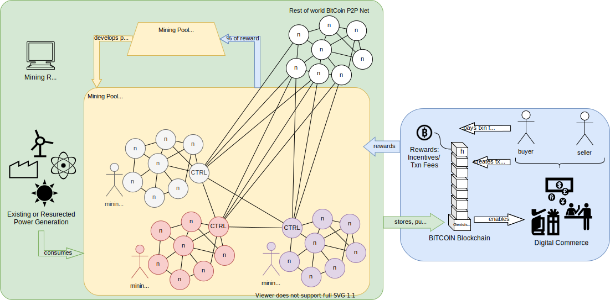
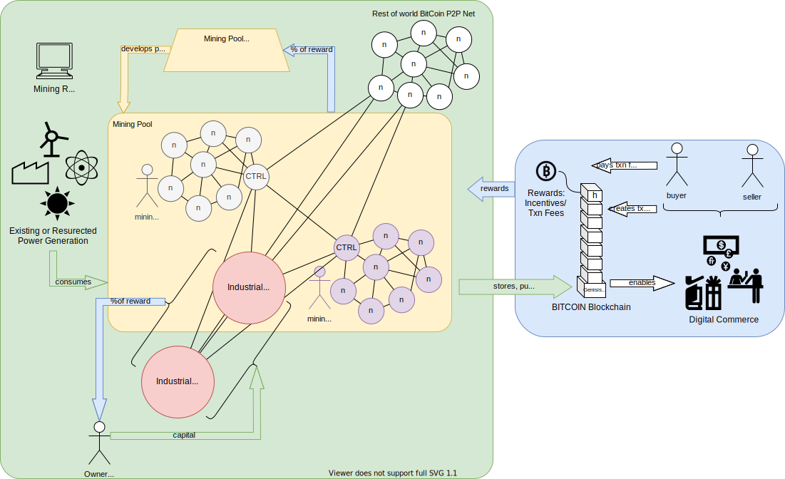
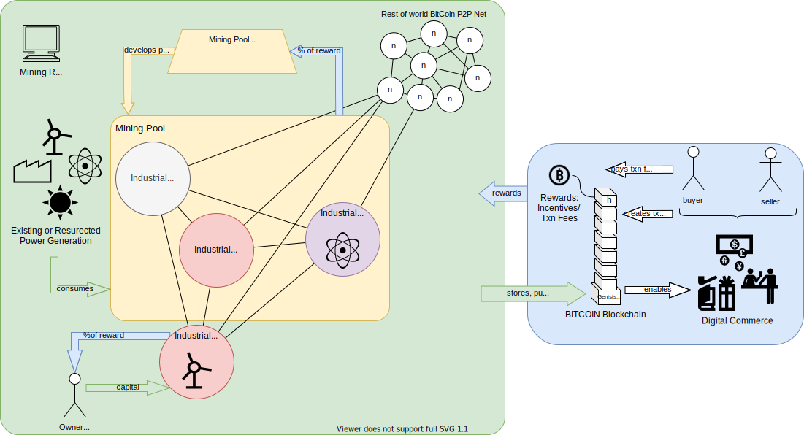
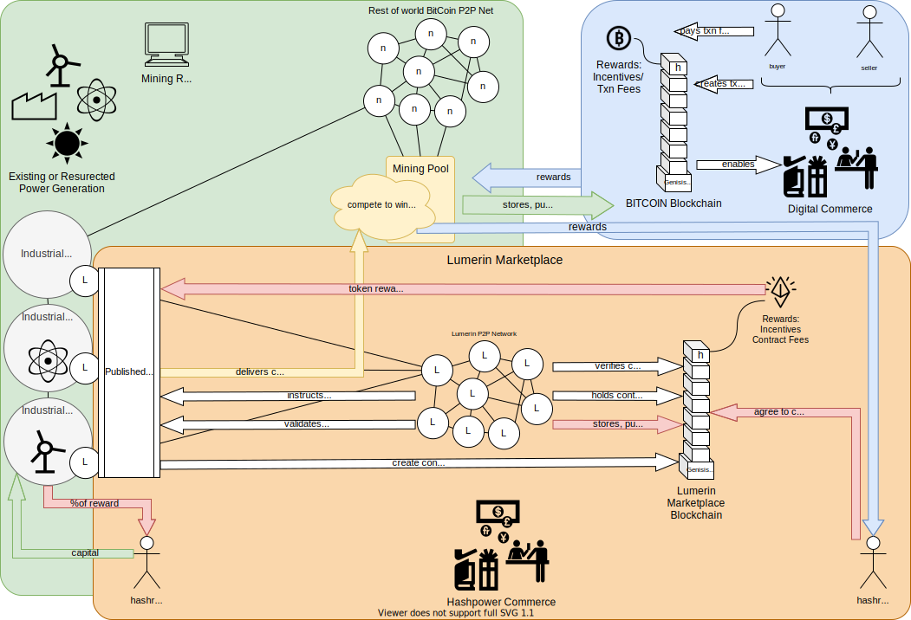
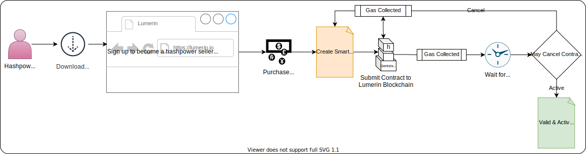
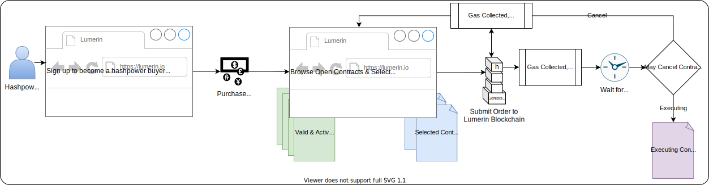
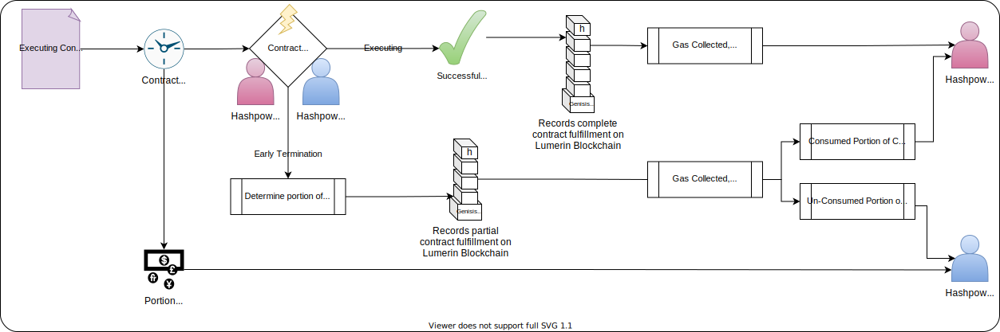

# Lumerin Overview 
December 2021 | DRAFT v.2
Latest update: December 5, 2021

## Introduction

Welcome to an overview of Titan’s Lumerin Marketplace and the value of mining the Lumerin token to ensure secure, open, equitable trading of provable hashpower. 

With the tremendous advancements in technology, the aggregation of mining entities, and visibility on the global stage, there is a need to improve efficiency and effectiveness of mining investments including leveraging surplus energy existing in the power grid and excess cycles available in mining farms.  

Lumerin will bring hashpower owners together with interested consumers for that hashpower designed to trade much like a standard utility or commodity. All of this will be done by leveraging the concepts and foundation of a decentralized, secure and open ledger system that self secures and self supports.

In order to understand the necessity of a blockchain marketplace like Lumerin, we must start at the beginning.

## Stage 1 - Basics

**Figure 1.1 - Basic value transfer in the Bitcoin blockchain** 

Blockchain, via the invention and introduction of BitCoin, is a secure, decentralized ledger system for managing value transfer between parties in the digital (and physical) world. Many books and websites can provide an introduction to blockchain and we will not rehash (pun intended) the full history here.

As Figure 1.1 illustrates, electrical power is consumed by specialized mining computers which are owned and managed by miners to secure blocks of Bitcoin transactions between buyers and sellers that yield both a reward (Bitcoin/coinbase and transaction bounties) and a surety that the transactions are valid, immutable and proper.  This security is enabled by solving complex hashing algorithms that take large amounts of compute power to realize.  This ensurees the immutability of the block where no one else could consume enough power or use enough hardware to ‘reverse’ transactions or double-spend a coin. 

## Stage 2 - Pools

**Figure 2.1 - Introduction of Mining Pools**

For many of the early years of Bitcoin, individual miners were competing on a more-or-less level playing field.  However, as the capital influx and broader interest increased, an imbalance occurred where larger organizations could build bigger and better mining farms that increased their advantage over the solo miner in the network.  The genesis of mining pools was used to help combat the well funded miner organization by enabling solo-miners to solve blocks collectively and re-level the playing field against larger organizations.  

The primary mechanisms to manage and control pool mining were much the same as the original blockchain structure.  Open ledger and transactions and smaller problem solving sets to “prove” the owned hashrate of member mining farms.  This provable hashrate was the metric by which the reward was shared between the participants if the pool won the block. As with all new technologies and approaches, pool mining was a chance for bad actors to figure out ways to game the system, take advantage of others and un-balance the field once again. While most transactions and interactions within a blockchain are anonymous and hashed, patterns, over time, were recognized and exploited to unfair advantage.  

**Figure 2.2 - Investors and Larger Mining farms in pools**

The next iteration of maturity as the Bitcoin adoption increased were large scale, industrial investment in mining operations that operated either independently or as part of mining pools. This started to provide a broader population access to reap consistent rewards from their investments.  For example, an investment of cash into an industrial mining company that was aggressively managing and growing their farms could likely predict the amount of times in a month, quarter or year they would win a block and return profit back to the original stakeholders.  So now, just like other commodities, Bitcoin could be invested and traded. 

More recently, there have been new entrants into the industrial mining landscape in the form of utility companies who see mining as both a way to load balance their electrical output (making them more efficient) and also reap the benefits of block mining like any other organization.  Utility companies have a unique advantage of knowing where the electricity is produced and the most efficient way to get it to the mining nodes … sometimes being directly on site at the power generation station.

**Figure 2.3 - Larger Industrial Mining Farms with Colocated Power Generation**

At this point in time, we have a great deal of new actors and demands on the overall blockchain and Bitcoin systems that are driving innovation like the Lumerin Marketplace & Token.  Many individuals and companies want to reap rewards with managed risk of investment, power companies want to drive efficiencies in their industry, financial institutions and regulators want to ensure stability of commerce, bad actors want to take advantage of a system in its infancy to their gain, and at the end of the day, some folks just want to buy their cup of coffee or new Tesla with digital currency.   

Which brings us to the critical challenge in the next stage of blockchain evolution:  `How do we guarantee the open and decentralized nature of blockchain, keep bad actors at bay, and provide secure commerce for the buying, selling and trading of hashpower that is the underpinning of the developing global cryptocurrency economy?` 

## Stage 3 - Marketplace 

The solution is to use fundamental decentralized blockchain concepts, coupled with smart contracts to bring together hashpower sellers with interested buyers to easily and simply transact … giving those who have hashpower to those who would like to use it.  These exchanges can be anonymous, secure and low risk if kept to the original open ledger / blockchain tenents. However, if the systems design starts to centralize, or is vulnerable to attack or misuse, the global community will not support its sustainability.  Open source decentralization solutions cut both ways...the community decides if the system fits the requirements and demonstrates capable security & visibility or it ignores the solution to atrophy into the history books.

**Figure 3.1 - Lumerin Hashrate Marketplace Conceptual Architecture**

The Lumerin Marketplace utilizes an Ethereum-based blockchain to mine and mint Lumerin tokens. These blocks contain smart contracts and transactions that describe sellers’ hashrate capabilities and combine them with buyers’ intended purchases.  The reward and contract fees for the Lumerin blocks are distributed back to the hashrate providers upon successful completion of the contract while the contract buyers share in the potential mining reward on the designated blockchain.

### Seller's Journey (Offering Contract)
1. Download the Lumerin open source software and install on node 
    * Setup, configuration and details included in that repository
    * Connect to the Lumerin public P2P network and become part of the Lumerin network
1. Connect to `lumerin.io` and sign in to become hashrate provider (KYC and AML checks) 
1. Purchase Lumerin token (ERC 20) with Ethereum or other currency via exchange 
1. Create a "Seller's Contract" or Implementation via the Lumerin clone factory 
    * **X Hashrate for Y Duration for N Lumerin** 
1. Submit the Contract to the Lumerin Network Blockchain 
1. Wait...for the contract to be purchased by a buyer 
    * Seller can revoke or edit an Available contract at any time 

**Figure 3.2 - Seller Journey**

### Buyer's Journey (Purchasing Contract)
1. Connect to `lumerin.io` and sign in to become hashrate consumer (KYC and AML checks) 
1. Purchase Lumerin token (ERC 20) with Ethereum or other currency via exchange 
1. Browse & select Available contracts 
1. Provide source of Lumerin, Gas and stratum address of target mining pool
1. Wait .... for the contract to be executed on the target pool

**Figure 3.3 - Buyer Journey**

### Contract Journey 
#### Execution State
1. Contract is Running  
1. Lumerin tokens from buyer are in escrow, waiting for successful execution 
1. Instructions are sent to Mining Farm to execute contract on desired pool for desired blockchain for agreed contract terms (difficulty/hashrate)
1. Mining begins...(mining farm has become part of the desired pool and solving target hashes)

#### Early Termination Event
1. If the contract is Running and is terminated early, the contract will be concluded and pro-rated Lumerin will be transferred to seller and remainder transferred back to buyer based on hashrate actually delivered.
    * Termination can happen at buyer or seller request or for any failure where the agreed hashrate is not delivered 
1. Example: 
    * A 24 hour contract has been purchased 
    * In the 12th hour of a running contract the seller's mining farm goes offline
    * When the farm recovers and compares mined block height (duration), decides that 1/2 the contract was performed 
    * 1/2 the agreed contract amount will be transferred from escrow to the seller, 
    * 1/2 the remaining contract amount will be transferred from escrow to the buyer, 
    * Contract will be marked as Completed

#### Successful State
1. Upon successful completion and verification of executed hashrate
1. Full amount of purchase will be transferred from escrow to buyer 
1. Contract will be marked as Completed 
1. Any rewards or incentives from target blockchain mining will be transferred from that pool directly to buyer's provided wallet address

**Figure 3.4 - Contract Journey**

### Summary 
We have walked through a brief (and truncated) history of crypto-mining and the unbalancing and rebalancing mechanisms and practices put into place over time to keep the environment equitable and aligned to the foundation started many years ago. 
With the Lumerin Blockchain, Token and Marketplace, we are enabling the next stage of balancing and commoditizing the world's hashrate and accessibility for both sellers and consumers of hashpower.

For more information, visit [titan.io](https://titan.io "titan.io") or [lumerin.io](https://lumerin.io "lumerin.io")