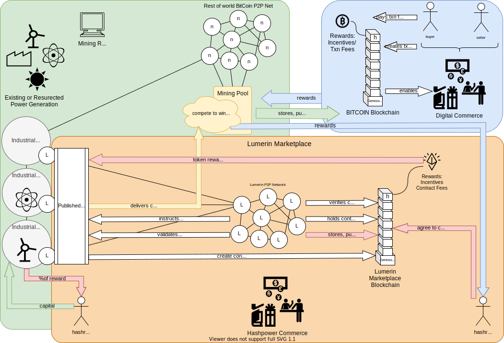

# Lumerin Introduction 

October 2021 | Sorber, Alan | DRAFT 

## Overview

The goal of this paper is to walk the reader through and overview of Titan’s Lumerin Marketplace and the necessity of mining the Lumerin token to ensure secure, open, equitable trading of provable hashpower. 

With the tremendous advancements in technology, the aggregation of mining entities, and visibility on the political and traditional financial stages, we are seeing a push to improve the efficiency and effectiveness of mining investments including leveraging wasted power existing in the power grid and excess cycles in the mining farms.  

Lumerin will bring together owners/sellers of hashpower with buyers of that hashpower that can be designed to trade much like a standard utility or commodity. All of this will be done by re-building on the concepts and foundation of a decentralized, secure and open ledger system that self secures and self supports.

In order to understand the advancement and necessity of a blockchain marketplace like Lumerin, we must start at the beginning.

## Stage 1 - Basics

**Figure 1.1 - Basic value transfer in the Bitcoin blockchain** 

Blockchain, via the invention and introduction of BitCoin, is a secure, decentralized ledger system for managing value transfer between parties in the digital (and eventually physical) world. Many books and websites can provide an introduction to blockchain and we will not rehash (pun intended) the full history here.

As Figure 1.1 illustrates, electrical power is consumed by specialized mining computers which are owned and managed by miners to secure blocks of Bitcoin transactions between buyers and sellers that yield both a reward (Bitcoin/coinbase and transaction bounties) and a surety that the transactions are valid, immutable and proper.  This security is via solving complex hashing algorithms that take large amounts of energy to produce thereby, as time passes, ensuring the immutability of the block (no one else could consume enough power or use enough hardware to ‘reverse’ transactions). 

## Stage 2 - Pools

**Figure 2.1 - Introduction of Mining Pools**

For many of the early years of Bitcoin, individual miners were competing on a more or less level playing field.  However, as the capital influx increased, an imbalance occurred where larger organizations could build bigger and better mining farms that increased their advantage over the solo miner in the network.  The genesis of mining pools was used to help combat the well funded miner organization by enabling solo-miners (for a small portion of the potential reward) to solve blocks collectively and re-level the playing field against larger organizations.  

The primary mechanisms to manage and control pool mining were much the same as the original blockchain structure.  Open ledger and transactions and smaller problem solving sets to “prove” the owned hashrate of a certain group.  This provable hashrate was the metric by which the reward was shared between the participants if the pool won the block. As with all new technologies and approaches, pool mining was a chance for bad actors to figure out ways to game the system, take advantage of others and un-balance the field once again. While most transactions and interactions within a blockchain are anonymous and hashed, patterns, over time,  were recognized and exploited for unfair advantage.  

**Figure 2.2 - Investors and Larger Mining farms in pools**

The next iteration of maturity as the Bitcoin adoption increased were large scale, industrial investment in mining operations that operated either independently or as part of mining pools. This started to provide broader sets of investors, some of whom had no idea what Bitcoin or blockchain were, access to reap consistent rewards from their investments.  For example, an investment of cash into an industrial mining company that was aggressively managing and growing their farms could likely predict the amount of times in a month, quarter or year they would win a block and return profit back to the original stakeholders.  So now, just like other commodities like energy, pork bellies or orange juice, Bitcoin could be invested and traded. 

Most recently (2019+) there have been new entrants into the industrial mining landscape in the form of utility & electric companies who see mining as both a way to load balance their electrical output, making them more efficient, and also reap the benefits of block mining like any other organization.  Utility companies have a unique advantage of knowing where the electricity is produced and the most efficient way to get it to the mining nodes … sometimes being directly on site at the power generation station.

**Figure 2.3 - Larger Industrial Mining Farms with Colocated Power Generation**

At this point in time, we have a great deal of new actors and demands on the overall blockchain and Bitcoin systems that are driving innovation like the Lumerin Marketplace & Token.  Many individuals and companies want to reap rewards with managed risk of investment, power companies want to drive efficiencies in their industry, financial institutions and regulators want to ensure stability of commerce, bad actors want to take advantage of a system in its infancy to their gain, and at the end of the day, some folks just want to buy their cup of coffee or new Tesla with digital currency.   How do we ensure that we maintain the open, decentralized nature of blockchain, keep bad actors at bay, and provide secure commerce for the buying, selling and trading of hashpower that is the underpinning of the new, global crypto currency economy? 

## Stage 3 - Marketplace 

The answer, simplistically, is to recursively use the blockchain and bitcoin concepts, coupled with smart contracts to bring together sellers of hashpower with the buyers of hashpower to easily and simply transact … giving those who have hashpower to those who would like to use it.  These exchanges can be anonymous, secure and low risk if kept to the original crypto currency tenents. But if the systems design starts to centralize, or is vulnerable to attack or misuse, the global community will not support its sustainability.  Open source and decentralization cuts both ways...the community decides if the system fits the need with the appropriate security and visibility attributes or it ignores it to atrophy into the history books.

**Figure 3.1 - Lumerin Hashrate Marketplace Conceptual Architecture**

The Lumerin Marketplace utilizes the Ethereum based blockchain to mint and mine Lumerin tokens. These blocks will hold smart contracts and transactions that describe sellers’ hashrate capabilities and combine them with buyers’ intended investment.  The reward and contract fees for the Lumerin blocks are distributed back to the hashrate providers upon successful completion of the contract while the contract buyers share in the potential mining reward on the designated blockchain.

### Seller's Journey (Offering Contract)
1. Download the Lumerin open source software and install on node 
    * Setup, configuration and details included in that repository
    * Connects to the Lumerin public P2P network and becomes part of the Lumerin network
1. Connect to lumerin.io and signup to become hashrate provider (KYC and AML checks) 
1. Purchase Lumerin token (ERC 21) with Ethereum or other crypto via exchange 
1. Create a "Seller's Contract" called and Implementation via the Lumerin clone factory 
    * Essentially, publishing an agreement for: **X Hashrate for Y Duration for N Lumerin** 
    * **[CHECKTHIS]** or a certain amount of X hashes (which would include the rate and duration) for N Lumerin
    * **[CHECKTHIS]** Do we specify which crypto they're available to mine on (or is this future capaiblity ... multiple crypto?)
1. Submit the Contract to the Lumerin Network Blockchain 
    * Gas will be required to post since we are altering / writing to the world state 
1. Wait...for the contract to be accepted and executed 
    * Seller can revoke/invalidate the contract at any time
    * **[CHECKTHIS]** Contract may also be revoked if hashrate promised is not proven or available 

### Contract State 
1. Active and valid contracts are waiting for purchase in the Lumerin Marketplace / Interface 

### Buyer's Journey (Purchasing Contract)
1. Connect to lumerin.io and signup to become hashrate consumer (KYC and AML checks) 
1. Purchase Lumerin token (ERC 21) with Ethereum or other crypto via exchange 
1. Browse open contracts
    **[CHECKTHIS]** Is there a search function, aggregation function (these 10, those 12...etc...)
1. Select the contract(s) desired and provide source of Lumerin, Gas and target return address 
1. Wait .... for the contract to be executed 

### Contract State 
1. Contract is Executing 
1. Lumerin tokens from buyer are in escrow, waiting for successful execution 
1. Instructions are sent to Mining node / Farm to execute contract on desired pool for desired crypto for agreed contract terms (hashrate)

